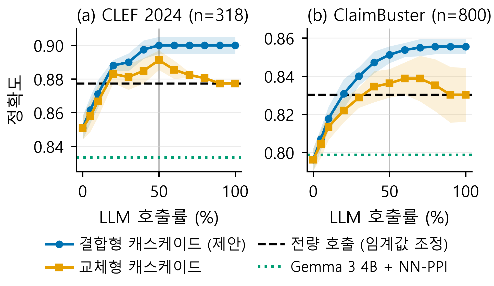

# 저비용 분류기와 대형 언어모델의 선택적 결합을 통한 팩트체크 필요성 탐지

**Cost-Efficient Check-Worthy Claim Detection via Selective Fusion of a Low-Cost Classifier and a Large Language Model**

이정빈 (Jeongbin Lee) · 2026 한국통신학회(KICS) 추계종합학술발표회 투고 논문의 코드·데이터·결과

---

## 요약

팩트체크 필요성 탐지(check-worthiness detection)는 유입되는 모든 문장에 적용되므로, 모든 문장에 대형 언어모델(LLM)을 호출하면 비용과 지연이 커진다. 본 저장소는 다음을 재현한다.

1. **NN-PPI 재현**: 선행연구 NN-PPI([arXiv:2608.30731](https://arxiv.org/abs/2608.30731))를 원 논문과 같은 Gemma 3 4B 설정으로 재현하였다. 같은 라벨과 문장 임베딩으로 SVM을 직접 학습하면 LLM 없이도 NN-PPI와 차이가 유의하지 않은 정확도를 얻는다.
2. **프런티어 LLM의 과소 판정**: Claude Sonnet 5를 모든 문장에 그대로 적용하면 팩트체크가 필요한 문장을 과소 판정한다. 라벨로 임계값을 조정하면 크게 개선된다.
3. **결합형 캐스케이드(제안)**: 분류기가 가장 불확실한 문장에만 LLM을 호출하고, LLM의 판정으로 **교체하지 않고** 분류기 결정값과 LLM 점수를 로지스틱 회귀로 **결합**한다. 호출률 50%에서 테스트 정확도는 LLM 전량 호출과 같거나 높았다.

## 주요 결과

테스트 정확도이며, 보정 세트의 80%를 비복원 추출해 5회 반복한 평균이다. 호출률은 프런티어 LLM에 질의한 문장의 비율이다.

| 방법 | 호출률 | CLEF 2024 (n=318) | ClaimBuster (n=800) |
|---|---:|---:|---:|
| Gemma 3 4B | 0% | 0.780 | 0.744 |
| + NN-PPI (k=10, 보정 세트에서 선택) | 0% | 0.833 | 0.799 |
| 임베딩 SVM | 0% | 0.851 | 0.796 |
| Claude Sonnet 5 전량 호출 | 100% | 0.821 | 0.807 |
| + 임계값 조정 | 100% | 0.877 | 0.830 |
| + NN-PPI (k=10, 보정 세트에서 선택) | 100% | 0.874 | 0.836 |
| 교체형 캐스케이드 | 50% | 0.891 | 0.836 |
| **결합형 캐스케이드 (제안)** | **50%** | **0.900** | **0.851** |
| 결합형 캐스케이드 (제안) | 100% | 0.900 | 0.855 |

- 결합형(50%)과 전량 호출(임계값 조정)의 차이: ClaimBuster에서 McNemar p=0.004, CLEF에서는 p=0.12로 유의하지 않다. NN-PPI로 보정한 전량 호출(선행연구의 가장 강한 설정)보다는 2.6%p, 1.5%p 높지만 유의하지 않다(p=0.07, 0.06).
- 호출률 50%는 테스트가 아니라 보정 세트에서 정했다. 보정 세트의 교차적합 정확도는 50% 이후 0.1%p 이하로만 올라 포화되었고, 전량 호출과의 차이는 0.7%p 이내였다. (`final_eval.py`의 `fuse_sel`은 별도로 미리 정해 둔 규칙 "보정 정확도가 전량 호출에 도달하는 최소 호출률"의 결과로, 포화 수준이 전량 호출보다 조금 낮아 대부분 100%를 고른다. 논문 수치에는 쓰지 않았다.) 보정 데이터에서는 테스트에서와 같은 초과 성능이 뚜렷하지 않았으므로, 테스트에서의 우위는 데이터 분할에 따라 달라질 수 있다.
- 문장 단위 스트리밍 라우팅(보정 세트에서 |d| 문턱을 고정)에서도 CLEF 0.897(실제 호출 44%), ClaimBuster 0.851(49%)로 정확도가 비슷했다.
- 분류기가 확신하는 절반의 문장에서 교체형은 SVM의 옳은 판정 28건을 틀리게, 16건을 옳게 바꾸었지만 결합형은 2건만 틀리게 바꾸었다(ClaimBuster, 1회차).



## 방법

- **저비용 분류기**: `all-MiniLM-L6-v2` 문장 임베딩(NN-PPI가 이웃 검색에 쓰는 것과 같은 임베딩)을 입력으로 받는 RBF-SVM이다. 클래스 균형 가중치를 쓰며, 하이퍼파라미터는 기본값이다. CPU에서 문장당 약 6 ms가 걸린다.
- **라우팅**: 결정값 $|d(x)|$가 작은 순서로 비율 $\rho$만큼의 문장을 LLM에 질의한다.
- **결합**: $\hat y(x) = \mathbb 1[\sigma(a\,d(x) + b\,s(x) + c) \ge 0.5]$. $(a,b,c)$는 보정 세트에서 5겹 교차적합으로 얻은 $d$와 LLM 점수 $s$로 학습한 로지스틱 회귀 계수다.
- **교체형(비교군)**: 같은 문장을 선택하되, 보정 세트에서 고른 임계값을 LLM 점수에 적용한 판정으로 교체한다.
- **누수 방지**: LLM 임계값, 결합 계수, NN-PPI의 k, 호출률은 모두 보정 세트 안에서만 정했다.

## 저장소 구조

```
cwcascade/                 공통 라이브러리
  data.py                  데이터·LLM 점수 로딩, 임베딩, 임계값 탐색
  nnppi.py                 NN-PPI 베이스라인
  prompt.py                NN-PPI 판정 기준 프롬프트 (Gemma few-shot)
scripts/
  final_eval.py            본 실험 (표 1, 그림 1)            -> results/final_results.json
  streaming_eval.py        문장 단위 라우팅 점검              -> results/streaming_results.json
  sanity_checks.py         배치/단건 채점 AUC, 재채점 상관, SVM 지연시간
  verify_paper_numbers.py  논문 PDF의 모든 수치를 results/*.json과 대조
  make_figure.py           그림 1                            -> figures/cascade_budget.{pdf,png}
  score_gemma.py           Gemma 3 4B 채점 (llama.cpp 서버)
  build_frontier_prompts.py / run_frontier_batch.sh   Claude Sonnet 5 배치 프롬프트 생성·채점
data/
  build_datasets.py        원본 → data/processed 분할 생성
  processed/               CLEF 2024, ClaimBuster 보정/테스트 분할 (CSV)
  frontier/                프런티어 LLM 평가 세트 (eval_set.json, calib_set.json)
results/
  gemma/                   Gemma 3 4B 원시 응답과 점수 (4개 분할, 6,783 문장)
  frontier/batches/        Claude Sonnet 5 배치 프롬프트(.txt)와 응답(.out)
  frontier/single/         CLEF 80문장 단건 채점 (배치 채점 타당성 점검용)
  frontier/rerun/          CLEF 테스트 2차 배치 채점 (안정성 점검용)
  *.json, *.log            평가 결과와 실행 로그
figures/                   논문 그림
```

## 재현 방법

[uv](https://docs.astral.sh/uv/)가 필요하다. 모든 명령은 저장소 루트에서 실행한다.

```bash
uv sync --locked --all-extras

# 1) 평가 (저장된 LLM 점수를 사용하며 CPU에서 수 분 소요)
uv run --locked python scripts/final_eval.py
uv run --locked python scripts/streaming_eval.py
uv run --locked python scripts/sanity_checks.py
uv run --locked python scripts/make_figure.py

# 2) 논문 수치 대조
uv run --locked python scripts/verify_paper_numbers.py <논문.pdf>     # -> ALL MATCH
```

평가는 커밋된 LLM 점수(`results/gemma`, `results/frontier`)만 사용하므로 GPU나 API 키가 필요 없다. 같은 코드로 다시 실행하면 `results/final_results.json`이 동일하게 재생성되는 것을 확인하였다.

LLM 점수를 처음부터 다시 만들려면 다음을 실행한다. 샘플링이 있으므로 점수는 조금씩 달라질 수 있다.

```bash
# 원본 데이터를 data/raw/에 받은 뒤 분할 생성 (출처는 아래 '데이터' 참고)
uv run --locked python data/build_datasets.py

# Gemma 3 4B: llama.cpp 서버에서 NN-PPI 부록 C 설정(T=1.0, top-k=64, top-p=0.95)
llama-server -m google_gemma-3-4b-it-Q4_K_M.gguf --port 8080 -c 8192 -ngl 99
uv run --locked python scripts/score_gemma.py --dataset data/processed/clef_test.csv --out results/gemma/clef_test_scores.jsonl
#   (clef_calib, claimbuster_calib, claimbuster_test도 같은 방식)

# Claude Sonnet 5: Claude Code CLI(`claude -p`)로 40문장씩 배치 채점
uv run --locked python scripts/build_frontier_prompts.py
cd results/frontier && ls batches/*.txt | xargs -P 6 -n 1 bash ../../scripts/run_frontier_batch.sh
```

## 데이터

| 데이터셋 | 출처 | 라이선스 | 사용 분할 |
|---|---|---|---|
| CLEF 2024 CheckThat! Task 1 (영어) | [HF `iai-group/clef2024_checkthat_task1_en`](https://huggingface.co/datasets/iai-group/clef2024_checkthat_task1_en) | CC BY-SA 4.0 | 보정: train에서 클래스 균형 2,406문장(Gemma 파싱 성공 2,405) / 테스트: 공식 318문장 |
| ClaimBuster | [Zenodo 3836810](https://zenodo.org/records/3836810) | CC BY 4.0 | 보정: 2012년 토론 1,314문장 / 테스트: 2016년 토론 2,745문장 중 무작위 800문장 |

`data/processed/`의 CSV는 위 원본에서 `data/build_datasets.py`로 만든 파생물이며 원본 라이선스를 따른다.

## 유의 사항

- **ClaimBuster 800문장 표본**: 프런티어 LLM 비용 때문에 2016년 테스트 2,745문장 중 800문장을 무작위로 뽑았다. 추출 시드는 기록되지 않았으므로 표본은 `data/frontier/eval_set.json`으로 고정해 제공한다.
- **Few-shot 예시**: NN-PPI는 few-shot 예시 6개를 공개하지 않았다. `cwcascade/prompt.py`의 예시는 원 논문의 6단계 기준에 맞춰 직접 작성한 것이다.
- **배치 채점**: 프런티어 LLM은 한 번에 40문장씩 채점하였다. CLEF 80문장을 단건으로도 채점했는데, 그중 11건은 CLI 사용량 한도 초과로 응답이 없었다. 나머지 69문장에서 ROC-AUC는 단건 0.991, 배치 0.990으로 같았다. CLEF 테스트를 두 번 배치 채점한 점수의 상관계수는 0.973이다.
- **선행 연구와의 관계**: 위임한 입력에서 두 모델의 출력을 선택적으로 결합하는 캐스케이드는 일반 분류 과제에서 CAUC([arXiv:2609.11446](https://arxiv.org/abs/2609.11446))가 먼저 제안하였다. 본 연구는 팩트체크 필요성 탐지에 이를 적용하면서 결합 가중치를 라벨로 학습한다.
- **한계**: 영어 데이터셋 두 개와 프런티어 모델 하나로만 평가하였고, 비용은 호출률로만 보고하였다.

## 다른 브랜치

이 브랜치(`release`)에는 논문에 쓰인 코드만 정리해 두었다. 연구 과정의 탐색 기록은 다음 브랜치에 그대로 남아 있다.

| 브랜치 | 내용 |
|---|---|
| `fusion-cascade` | 결합형 캐스케이드 실험의 원본 커밋 이력 (탐색용 스크립트 포함) |
| `nnppi-reproduction` | NN-PPI 재현 및 신뢰구간 커버리지 보정 연구 (`REPORT.md`) |
| `prompt-reorder-ablation` | 프롬프트·채점 방식 변형 실험과 임베딩 분류기 발견 과정 |
| `safety-flag-extension` | 다른 도메인(Safety-Flag)으로의 전이 실험 |
| `topic-venue-research` | 주제 선정과 학회 적합성 검토 기록 |

## 참고 문헌

- P. Amatya, Venktesh V, V. Setty, "Calibrating Small Language Models for Claim Check-Worthiness Detection," arXiv:2608.30731, 2026.
- A. Barrón-Cedeño et al., "Overview of the CLEF-2024 CheckThat! Lab," CLEF 2024, LNCS, 2024.
- F. Arslan, N. Hassan, C. Li, M. Tremayne, "A Benchmark Dataset of Check-Worthy Factual Claims," ICWSM, 2020.
